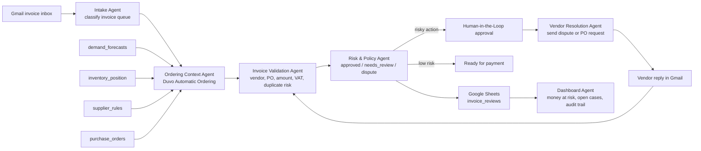

# Procurement Control Tower

One-day hackathon demo for a Duvo automation that validates purchasing intent, reviews vendor invoices before payment, and closes vendor disputes from Gmail replies.

The workflow:

1. Duvo Automatic Ordering validates the upstream PO context from forecast, inventory, supplier, and approval data.
2. Vendor invoice arrives in Gmail.
3. Duvo extracts invoice fields from the attachment/body.
4. Duvo compares the invoice against Google Sheets purchase orders and uploaded policy files.
5. Duvo logs the review in `invoice_reviews`.
6. Duvo asks for human approval before sending dispute emails or marking high-value invoices ready for payment.
7. Duvo handles vendor replies, links them back to the open invoice case, and closes the loop when a correction or missing PO is confirmed.

## How it works



In the batch demo, Duvo processed three invoice emails, reordered them by risk, blocked EUR 10,150 in duplicate and overcharged payments, requested approval, sent vendor dispute emails, and updated `invoice_reviews` with Gmail message IDs.

## What is in this repo

- `src/vendor_invoice_autopilot.py` - deterministic review engine used for local validation and demo output.
- `scripts/run_demo.py` - runs synthetic invoices through the review engine and writes a Sheets-ready CSV.
- `data/*.csv` - seed data for Google Sheets tabs, including Automatic Ordering context.
- `demo_inbox/*.eml` - Gmail-style sample messages for the live story.
- `demo_invoices/*.json` - extracted invoice payloads matching the sample messages.
- `demo_replies/*.json` - vendor reply payloads that resolve open dispute and missing-PO cases.
- `duvo/*.md` - assignment SOP, approval policy, and demo script to paste into Duvo.
- `tests/test_vendor_invoice_autopilot.py` - acceptance scenarios for invoice review and closed-loop vendor replies.

## Local demo

```bash
python3 scripts/run_demo.py
python3 scripts/run_real_case_test.py
python3 -m unittest tests/test_vendor_invoice_autopilot.py tests/test_real_case_email_flow.py
```

The demo writes `out/invoice_reviews.csv`. Import `data/vendors.csv`, `data/demand_forecasts.csv`, `data/inventory_position.csv`, `data/supplier_rules.csv`, `data/purchase_orders.csv`, and `out/invoice_reviews.csv` into Google Sheets as the demo tabs.
The real-case smoke test writes `out/real_case_invoice_reviews.csv` and uses the four email fixtures in `live_cases/emails/`.

For a faster Google Sheets setup, import `outputs/vendor_invoice_autopilot_workbook.xlsx`. It already contains the `vendors`, `demand_forecasts`, `inventory_position`, `supplier_rules`, `purchase_orders`, `invoice_reviews`, and `demo_reviews_backup` tabs. Rebuild it with `scripts/create_workbook.py` after changing demo data.

## Duvo setup

1. Connect Gmail and Google Sheets in Duvo.
2. Enable the Duvo `Automatic Ordering` skill on the assignment.
3. Upload the files in `duvo/` as assignment reference files.
4. Create a Google Sheet with tabs named `vendors`, `demand_forecasts`, `inventory_position`, `supplier_rules`, `purchase_orders`, and `invoice_reviews`.
5. Paste `duvo/assignment_sop.md` into the assignment SOP.
6. Send one of the `demo_inbox/*.eml` examples, or copy the email body into a real Gmail message.
7. Run the assignment and show Duvo's live execution/audit trail.

## Judging angle

- Real workflow: procurement-to-payment control, not just invoice checking.
- Complexity: demand/PO validation, extraction, policy lookup, PO matching, duplicate detection, risk scoring, conditional approval, and closed-loop vendor reply resolution.
- Duvo capabilities: Automatic Ordering, Gmail, Google Sheets, Files, Human-in-the-Loop, audit/live execution.
- Business impact: prevents overpayment and reduces AP review time.
- Wow moment: Duvo does not start at the invoice. It validates why the PO exists, blocks bad invoices before payment, emails the vendor with approval, reads the vendor's reply, updates the case state, and leaves a complete audit trail.
